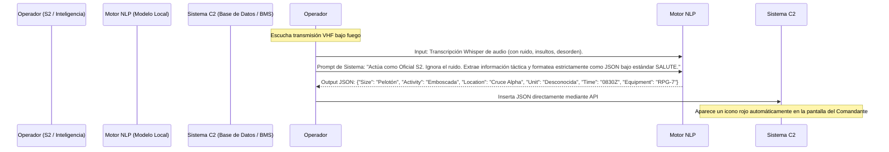

# Módulo 3: Herramientas Generativas y Procesamiento de Lenguaje Natural (NLP) Militar

## Información del Módulo
* **Unidad:** U2 - IA Generativa y Ética
* **Duración estimada:** 2.5 horas
* **Modalidad:** Presencial (Taller práctico BYOD)

## Objetivos del Aprendizaje
1. Desmitificar la arquitectura de los Modelos Fundacionales (Transformers) y su capacidad para procesar léxico táctico.
2. Dominar técnicas avanzadas de *Prompt Engineering* para estructurar Inteligencia y generar reportes OTAN estandarizados.
3. Automatizar la ingesta de OSINT (Inteligencia de Fuentes Abiertas) y transcripciones de radio ruidosas (Speech-to-Text).

## Contenido Detallado Técnico

### 1. Arquitectura Base: Transformers aplicados a Inteligencia
Los Modelos de Lenguaje de Gran Escala (LLM) no "piensan", sino que calculan probabilidades matemáticas de distribución de *tokens* basados en una arquitectura introducida en 2017: el **Transformer**.
* **Mecanismo de Auto-Atención (Self-Attention):** Permite al modelo contextualizar la jerga militar. Por ejemplo, en la frase "El observador reporta una *batería* destruida junto al río", el mecanismo de atención asigna alto peso a "observador" y "destruida" para inferir que "batería" refiere a una unidad de artillería, y no a un acumulador eléctrico.
* **Fine-Tuning Militar:** Por qué los modelos comerciales (ChatGPT) fallan en operaciones. Necesidad de realizar *Fine-Tuning* (Ajuste Fino) de modelos Open Source (ej. LLaMA 3, Mistral) utilizando corpus documentales del Ejército (Glosario de Terminología Militar, manuales de campaña) para que el modelo genere un lenguaje institucional preciso y entienda acrónimos complejos (Ej. CIS, JPR, MEDEVAC, TOC).

### 2. Prompt Engineering para Inteligencia Táctica (Framework RTF)
El diseño de Prompts en un Estado Mayor exige rigor paramétrico. Se emplea el framework **RTF (Rol, Tarea, Formato)**.

### 3. Técnicas Avanzadas de Interacción (In-Context Learning)
* **Few-Shot Prompting:** Dado que los modelos pueden tener un tono civil, el S2 debe incluir en el prompt 2 o 3 ejemplos de *Partes de Novedades* históricamente correctos. Esto obliga al modelo a replicar el estilo de redacción lacónico y directo militar.
* **Extracción de Entidades Nombradas (NER):** Uso de la IA generativa para procesar telegramas, canales de Telegram (OSINT) o documentos capturados (DOCEX), extrayendo automáticamente nombres de comandantes enemigos, coordenadas MGRS y tipos de armamento, volcándolos en una base de datos grafo.
* **Chain-of-Thought (Cadena de Pensamiento):** Inducir al modelo a generar una "Apreciación de Inteligencia" obligándole a escribir su razonamiento paso a paso: "Primero, analizo el terreno. Segundo, evalúo la fuerza enemiga. Por lo tanto, concluyo que...". Esto facilita la auditoría humana de la conclusión.

## Actividades y Evaluación
* **Taller Táctico - De la Radio al BMS:** 
  * Los alumnos recibirán un archivo de texto con una transcripción altamente ruidosa ("Eh, aquí Charly 2, nos están disparando desde... joder, cuidado con ese árbol... desde la cota 600, parecen tres vehículos sobre ruedas, llevaban misiles, son las 1500 Zulu, tenemos un herido grave en la pierna..."). 
  * Deberán escribir y refinar de forma iterativa un Prompt avanzado para que el modelo local extraiga perfectamente, de una sola pasada:
    1. Un reporte **SALUTE** estructurado en JSON.
    2. Un reporte **MEDEVAC de 9 Líneas** para la evacuación del herido.
  * El sistema fallará la evaluación si la IA "alucina" información que no estaba en el audio.
