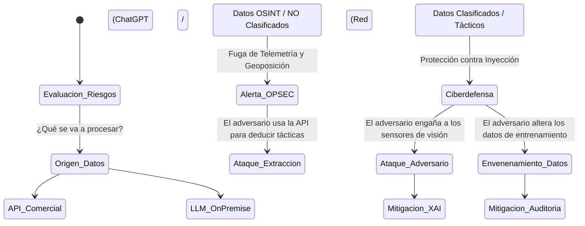

# Módulo 4: Ética, Regulación, OPSEC y Límites Tecnológicos

## Información del Módulo
* **Unidad:** U2 - IA Generativa y Ética
* **Duración estimada:** 2.5 horas
* **Modalidad:** Presencial

## Objetivos del Aprendizaje
1. Aplicar los principios éticos de la Directiva de Defensa Nacional, UE y la OTAN relativos al despliegue de Armas Autónomas Letales (LAWS) e IA de soporte.
2. Identificar vulnerabilidades críticas de Seguridad de las Operaciones (OPSEC) al emplear herramientas SaaS y APIs públicas en el entorno militar.
3. Comprender las técnicas de IA Explicable (XAI) y las amenazas adversarias (Data Poisoning, Adversarial Attacks).

## Contenido Detallado Técnico

### 1. Marco Regulatorio: De la Caja Negra a la Explicabilidad (XAI)
La integración de IA en el Ejército no está limitada por la tecnología, sino por la responsabilidad legal y ética. La OTAN establece principios irrenunciables (Legalidad, Responsabilidad, Explicabilidad, Fiabilidad, Gobernabilidad, Mitigación de Sesgos).
* **Sistemas de Armas Letales Autónomas (LAWS):** Regulación bajo la Convención sobre Ciertas Armas Convencionales (CCW) de la ONU. La doctrina occidental exige el *Human-in-the-Loop* (El humano toma la decisión de disparar) o *Human-on-the-Loop* (El sistema dispara automáticamente bajo parámetros estrictos, como los sistemas C-RAM o Phalanx, pero el humano tiene capacidad de veto e interrupción inmediata).
* **IA Explicable (XAI):** Aplicación de algoritmos como SHAP (SHapley Additive exPlanations) o LIME. Un Comandante no puede ejecutar un bombardeo solo porque "la red neuronal arrojó un 90% de probabilidad". SHAP permite visualizar qué píxeles exactos de la imagen satelital llevaron a la IA a concluir que el edificio es un búnker y no un hospital.

### 2. OPSEC y Vectores de Ataque contra la IA (Securing the Model)

La IA introduce nuevas superficies de ataque en la Ciberguerra.

### 3. Amenazas Específicas al Modelo de IA
* **Fuga de Datos (Data Leakage) por uso negligente:** Si un oficial introduce coordenadas logísticas en un servicio de IA generativa comercial para redactar un informe rápido, esos datos pueden ser utilizados para reentrenar el modelo comercial, y podrían ser extraídos por un adversario utilizando técnicas de *Prompt Extraction*.
* **Ataques Adversarios en Visión Artificial (Adversarial Patches):** La inserción de ruido digital imperceptible para el ojo humano en un camuflaje, o pintar un patrón específico sobre la lona de un camión, puede alterar por completo el modelo de visión YOLO del enemigo, provocando que su IA de inteligencia clasifique el camión de munición como "avestruz" o simplemente no lo detecte.
* **Envenenamiento de Datos (Data Poisoning):** Táctica cibernética donde el enemigo inyecta reportes o trazas de radar sutilmente erróneas durante meses en el *Data Lake* del Ejército, con el objetivo de corromper el reentrenamiento del modelo de detección, generando puntos ciegos intencionados.

## Actividades y Evaluación
* **Gabinete de Crisis (Simulación OPSEC y Ética):** Se presenta un incidente: Una herramienta de IA logística en zona de operaciones sugiere abandonar a un pelotón aislado porque matemáticamente el coste del reabastecimiento compromete la misión principal de la Brigada. Los alumnos debatirán el sesgo de optimización utilitaria de la máquina frente al liderazgo militar, y diseñarán las directrices para auditar y establecer *Guardrails* operativos que eviten este tipo de inferencias.
