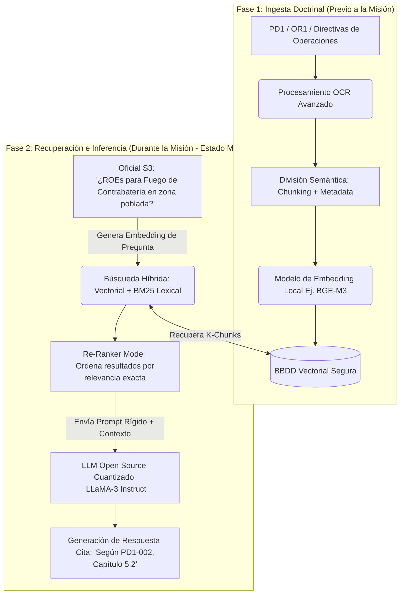

# Módulo 8: RAG (Retrieval-Augmented Generation) para Doctrina Militar

## Información del Módulo
* **Unidad:** U3 - Gestión de Datos y RAG
* **Duración estimada:** 2.5 horas
* **Modalidad:** Presencial (Taller práctico)

## Objetivos del Aprendizaje
1. Asimilar la arquitectura técnica de un Sistema RAG desplegado en local (On-Premise) para entornos "Air-Gapped".
2. Dominar técnicas avanzadas de indexación, *Chunking* semántico y vectorización de publicaciones doctrinarias (PD, DO, OR).
3. Evaluar métodos de recuperación (Búsqueda Híbrida y Re-Ranking) para garantizar precisión jurídica en la consulta de Inteligencia o Reglas de Enfrentamiento (ROE).

## Contenido Detallado Técnico

### 1. Vectorización de la Doctrina del Ejército de Tierra (MADOC)
El entrenamiento de un LLM desde cero es ineficiente y no garantiza la veracidad. RAG permite utilizar un modelo de lenguaje general y proporcionarle los manuales oficiales del Mando de Adiestramiento y Doctrina (MADOC) o las directivas del Estado Mayor de la Defensa (EMAD) como memoria externa de solo lectura.
* **Modelos de Embeddings (Representación Espacial):** Conversión de párrafos de texto libre en vectores matemáticos de alta densidad (ej. de 768 dimensiones). Los conceptos tácticamente sinónimos (Ej. "Despliegue defensivo", "Atrincheramiento", "Posición de bloqueo") se agrupan matemáticamente en la misma región del espacio vectorial.
* **Búsqueda Semántica vs. Léxica:** A diferencia de un buscador tradicional por palabras clave (Ctrl+F) que fallaría si se pregunta por "Vehículos pesados" y el manual dice "Carros de Combate", la búsqueda vectorial comprende el significado y recupera el texto correcto.
* **Bases de Datos Vectoriales en Defensa:** Uso de software de código abierto y auditable (como Qdrant o Milvus) ejecutándose en servidores desplegados en el Teatro de Operaciones, garantizando que ninguna consulta clasificada viaje por internet comercial.

### 2. Arquitectura Avanzada de RAG Táctico

### 3. Técnicas de Precisión y Guardrails Operativos
El valor diferencial de RAG para el Ejército es la **referencia estricta**. Si el modelo alucina tácticas inventadas, las consecuencias son catastróficas.
* **Chunking Inteligente:** Cómo se fragmentan los manuales. Si se parte el PDF brutalmente cada 500 caracteres, se rompe el contexto de una orden. Se deben emplear analizadores que fragmenten respetando cabeceras (Capítulo, Sección, Párrafo).
* **Guardrails (Mecanismos de Defensa):** Instrucciones de sistema irreversibles (Ej. *Nemo Guardrails*). Si el modelo busca en la base de datos y la puntuación de similitud (Cosine Similarity) es menor al 70%, el modelo está forzado a responder *"Materia no cubierta en la doctrina analizada. Consulte a la cadena de mando."* y bloquearse, impidiendo la invención narrativa.

## Actividades y Evaluación
* **Taller Táctico RAG en Python:** Utilizando frameworks como LangChain o LlamaIndex en cuadernos Jupyter (sin conexión a internet), los alumnos realizarán la ingesta completa de tres manuales operativos PDF (desclasificados). 
* Configurarán una estrategia de *Chunking* con solapamiento (Overlap) y realizarán pruebas de "Estrés Doctrinal": Deberán forzar al RAG a intentar alucinar información sobre manuales aéreos inexistentes en la base de datos, asegurándose de que los *Guardrails* detienen correctamente la generación de texto.
