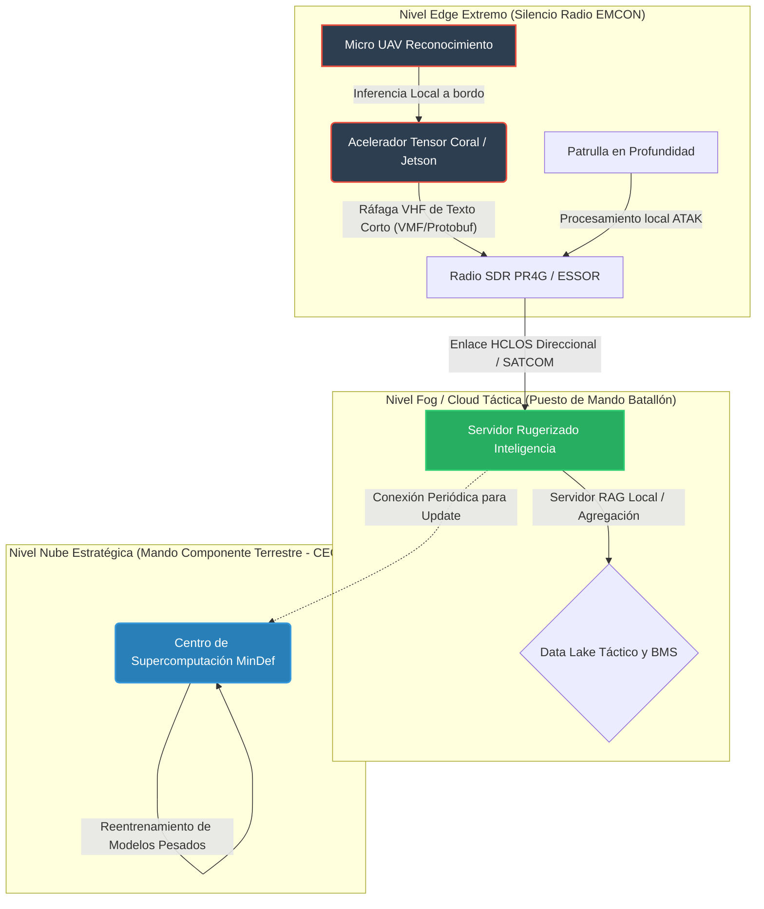

# Módulo 6: IA en Entornos Aislados (Edge AI en Escenarios DIL)

## Información del Módulo
* **Unidad:** U4 - Operativa y Protocolos
* **Duración estimada:** 2.5 horas
* **Modalidad:** Presencial

## Objetivos del Aprendizaje
1. Comprender los desafíos y vulnerabilidades de operar sistemas C2 y algoritmos en entornos DIL (Disconnected, Intermittent, Limited bandwidth).
2. Diferenciar y aplicar estrategias de procesamiento local (Edge AI) frente al procesamiento centralizado (Cloud Táctico) en el despliegue de una Brigada.
3. Aplicar técnicas matemáticas de compresión de modelos de IA (Cuantización, Poda, Destilación) para habilitar hardware militar de bajo SWaP-C.

## Contenido Detallado Técnico

### 1. El Desafío DIL y la Supervivencia Electromagnética (EMCON)
La dependencia de servicios alojados en "la Nube" (como los servicios centralizados del MinDef o infraestructuras BICES) representa una vulnerabilidad letal en escenarios A2/AD (Anti-Access/Area Denial). El adversario utilizará sistemas de Guerra Electrónica (EW) para interferir (Jamming) enlaces satelitales e interceptar firmas electromagnéticas.
* **Emisión Controlada (EMCON):** Mantener un enlace de datos continuo para enviar video en 4K desde un dron a un servidor para su procesamiento por IA delata inmediatamente la posición del operador.
* **La Solución Edge Computing:** La inferencia algorítmica debe realizarse en el "borde". Si el UAV Raven o Fulmar procesa el video a bordo utilizando su propio SoC (Ej. NVIDIA Jetson Nano), solo necesita romper el silencio de radio durante un microsegundo para emitir un paquete comprimido de texto: *"Coordenadas X, Y: T-90 Confirmado"*.

### 2. Arquitectura de Despliegue Jerárquico de IA (Edge-Fog-Cloud)

### 3. Optimización Matemática para Hardware SWaP-C
El hardware militar que se lleva en la mochila del soldado o integrado en el chasis caliente de un Pizarro está severamente limitado por el SWaP-C (Size, Weight, Power and Cost). No se pueden instalar servidores que requieran refrigeración líquida ni picos de 1000 W de potencia.
* **Cuantización de Redes (INT8 / FP16):** Reducción de la precisión matemática de los parámetros de la red neuronal. Convertir pesos de 32-bit (coma flotante) a números enteros de 8-bit. Multiplica la velocidad de inferencia por 4x y divide el consumo de batería, con una degradación de precisión inferior al 1%.
* **Poda (Pruning):** Eliminación algorítmica de las conexiones neuronales débiles o redundantes del modelo para reducir su huella en la memoria RAM del sistema táctico.
* **Destilación de Conocimiento (Knowledge Distillation):** Técnica donde un modelo masivo "Profesor" (entrenado en supercomputadores) enseña a un modelo pequeño "Estudiante" a imitar sus decisiones. El modelo estudiante es el que se despliega finalmente en las radios definidas por software (SDR).

## Actividades y Evaluación
* **Arquitectura de Despliegue en Crisis:** Estudio de caso para seleccionar el hardware y la topología de red óptimos para integrar un sistema de reconocimiento de rostros y control de multitudes en un "Checkpoint" en Misión de Mantenimiento de Paz. Los alumnos deben considerar que el generador diésel sufre cortes, la conexión 4G no existe, la conexión satelital está reservada al Mando y las temperaturas alcanzan los 45ºC. Deberán justificar la elección de inferencia Edge frente a streaming.
