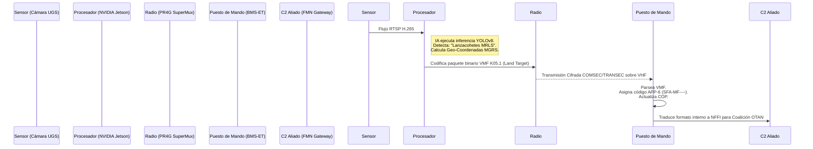

# Módulo 7: Protocolos de Comunicación e Interoperabilidad OTAN

## Información del Módulo
* **Unidad:** U4 - Operativa y Protocolos
* **Duración estimada:** 2.5 horas
* **Modalidad:** Presencial

## Objetivos del Aprendizaje
1. Comprender la integración de los protocolos modernos de IA (APIs, REST, Pub/Sub) con la arquitectura militar TDL (Tactical Data Links).
2. Estudiar la emisión e ingesta de mensajes estandarizados sobre redes de radio de combate de ancho de banda restringido.
3. Asegurar la interoperabilidad aliada empleando simbología MIL-STD-2525C / APP-6 y formatos NVG.

## Contenido Detallado Técnico

### 1. El Puente entre Sistemas Legacy y Microservicios de IA
La IA moderna se desarrolla sobre arquitecturas web (RESTful APIs, gRPC), pero debe comunicarse con sistemas de armas que operan con protocolos seriales o formatos propietarios desarrollados en la década de los 90.
* **Protocolos de Comunicaciones Tácticas TDL:**
  * **Link 16 / JREAP-C:** Red crítica para la defensa antiaérea y las operaciones conjuntas.
  * **VMF (Variable Message Format - MIL-STD-188-220):** Formato binario ultracomprimido estructurado en Series-K. Es el protocolo ideal para que un motor de IA reporte coordenadas de artillería detectadas sobre radios de banda estrecha (PR4G, Bowman).
* **Protocolos IoT y Enjambres:**
  * **MQTT / CoAP:** Protocolos asíncronos de publicación/suscripción. Utilizados en campos de Sensores Terrestres Desatendidos (UGS - cámaras camufladas, detectores magnéticos). Si un sensor sísmico detecta una vibración que su IA local clasifica como "Vehículo Cadenas", publica el evento en un *Topic* MQTT; el servidor del Puesto de Mando suscrito a ese *Topic* actualiza la pantalla del Comandante en milisegundos.

### 2. Estandarización Visual e Interoperabilidad Aliada (FMN)
* **Simbología Conjunta APP-6C / MIL-STD-2525:** La salida de cualquier modelo de detección visual (ATR) del ET no puede ser texto libre. El sistema de IA debe asignar el código jerárquico correspondiente a la ontología (Ej. *Hostile Ground Track Armor*).
* **NVG (NATO Vector Graphics) y NFFI (NATO Friendly Force Information):** Formatos estándar para inyectar trazados de maniobra y posiciones de unidades en la Imagen Operativa Común (COP).
* **Federated Mission Networking (FMN):** Marco OTAN para asegurar que una alerta de IA generada por un VCR español sea automáticamente comprendida por el sistema de mando C2 *SIT* francés o *Leopard 2* alemán.

### 3. Diagrama de Secuencia: Ingesta Automática en BMS-ET

### 4. DDS (Data Distribution Service)
Para sistemas complejos (como los sistemas de combate embebidos dentro de un blindado de nueva generación), el estándar es DDS. Es el mismo protocolo base de ROS2 (Robot Operating System). Permite el intercambio de datos en tiempo real estricto, gestionando Calidad de Servicio (QoS) para asegurar que un paquete de alerta térmica tenga prioridad absoluta sobre el tráfico de chat de texto en la red interna del vehículo.

## Actividades y Evaluación
* **Esquema de Federación Táctica:** Los alumnos diseñarán la arquitectura lógica y el flujo de red. Dada una plataforma experimental (un UGV autónomo de reconocimiento equipado con IA), definirán cómo el robot traduce sus descubrimientos mediante microservicios internos en Docker, los empaqueta en VMF, los transmite por una red mesh SDR MANET (Mobile Ad-Hoc Network) y los inyecta como simbología estandarizada APP-6 en el Centro de Operaciones Tácticas (TOC).
