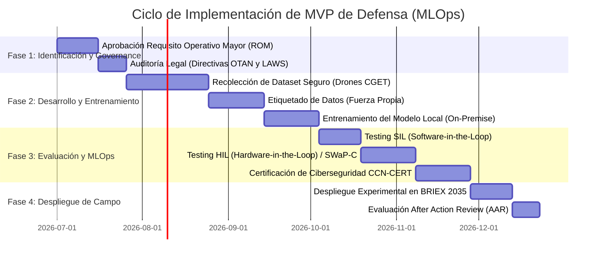

# Módulo 10: Planificación, Gestión y MLOps de Proyectos de IA Militar

## Información del Módulo
* **Unidad:** U5 - Estrategia y Proyectos
* **Duración estimada:** 2.5 horas
* **Modalidad:** Presencial (Taller Grupal Final Integrador)

## Objetivos del Aprendizaje
1. Aplicar la metodología **MLOps (Machine Learning Operations)** a las estrictas exigencias del ciclo de adquisición y despliegue del Ministerio de Defensa.
2. Identificar el impacto operativo de la "Deriva de Datos" (*Data Drift*) en tácticas adversarias y establecer ciclos de reentrenamiento continuo (CI/CD/CT).
3. Diseñar de principio a fin, y defender ante un tribunal militar simulado, el proyecto/MVP de una capacidad táctica basada en IA para el Ejército de Tierra.

## Contenido Detallado Técnico

### 1. MLOps de Defensa y Deriva de Datos (Data Drift)
A diferencia de un software clásico (como un procesador de textos) que no empeora con el tiempo, un modelo de IA militar sufre **decadencia táctica**. 
* **Data Drift:** Si un modelo de visión artificial del VCR 8x8 es entrenado en 2024 para detectar el camuflaje urbano enemigo, perderá efectividad drásticamente en 2026 si el enemigo cambia el patrón de sus redes mimetizadoras o despliega un nuevo modelo de blindado no visto antes en el dataset.
* **Ciclo de Reentrenamiento (Continuous Training):** 
  1. *Shadow Mode:* Despliegue de modelos en paralelo en las computadoras del blindado para recoger las detecciones erróneas sin afectar al tirador.
  2. *Feedback Loop:* Retorno de esas imágenes erróneas, vía enlace de datos cifrado o extracción USB física al finalizar la misión, hacia el Centro de Datos nacional.
  3. *Over-The-Air Updates (OTA):* Reentrenamiento del modelo en supercomputadores del MINDEF y despliegue automatizado de los nuevos pesos (archivos `.pt` o `.onnx`) hacia las Brigadas en el extranjero.

### 2. Soberanía Tecnológica y Adquisición (Gantt Operativo)
Evitar el *Vendor Lock-in* (dependencia total de una corporación privada). Necesidad de poseer el código fuente, la capacidad de ajuste fino interno y repositorios de datos soberanos propios del CESADAR (Centro de Sistemas de Adiestramiento).

### 3. Taller Final Integrador: "Dragón de Silicio"
* **Organización Práctica:** La clase se estructurará en equipos multidisciplinares asumiendo roles de Estado Mayor (S2 Inteligencia, S3 Operaciones, S4 Logística y S6 Sistemas/Transmisiones).
* **Misión:** Diseñar la arquitectura conceptual, viabilidad técnica e integración doctrinal de un Proyecto Piloto MVP (Producto Mínimo Viable) basado en IA para resolver un problema crónico de su unidad o especialidad.
  * *Ejemplos sugeridos:* Un pipeline RAG offline para mecánicos de escalón desplegado en tablets rugerizadas; un algoritmo Edge AI para procesar imágenes hiperespectrales desde micro-drones; un sistema de logística predictiva integrado en el SIGLE.
* **Componentes del Entregable:**
  1. Problema Operativo y Objetivos (¿Qué vector de letalidad o supervivencia mejora?).
  2. Trazabilidad de los Datos (Sensores implicados, arquitecturas de red, y formatos).
  3. Despliegue Edge/Cloud y consideraciones SWaP-C en hardware táctico.
  4. Evaluación de Riesgos y Guardrails (Medidas OPSEC, mitigación de sesgos, *Human-in-the-loop*).
* **Defensa (Pitch):** Breve exposición oral simulando un "Briefing" decisorio ante el General Jefe de la Brigada o MADOC.

## Actividades y Evaluación
* **Tribunal de Evaluación Continua Final:** El diseño y presentación de este MVP sirve como rúbrica final del Módulo. Se puntuará según el impacto operativo realista, la solidez técnica ante restricciones militares de red y energía, y las medidas de seguridad adoptadas para mitigar vulnerabilidades electromagnéticas.
